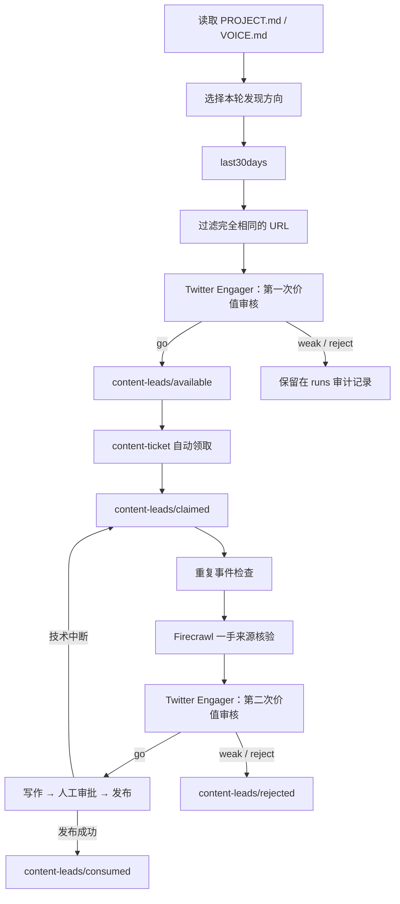

# 内容发现与内容生产解耦计划

## 目标

把当前“一张工单里完成发现、选题、核验和写作”的流程拆成两条独立流水线：

1. `codoop-content-discovery` 负责发现热点、判断讨论价值，并把值得继续核验的内容保存为未核验线索。
2. `codoop-content-ticket` 自动从线索池领取一条未使用线索，完成去重、来源核验、二次价值审核、写作、人工审批和发布。

首要优化指标不是“信息是否正确”，而是内容是否能给目标读者一个真实的评论或转发理由。实用价值、身份共鸣和真实讨论都可以成为理由；标题党、误导和空洞站队不可以。

## 已确认的产品决策

- 使用 `agency-agents` Marketing Division 的原始 `Twitter Engager` 角色，不修改角色定义。
- 角色文件固定使用 `skills/_shared/agents/marketing-twitter-engager.md`；每次调用只追加本次项目背景、输入材料、任务目的和限制。
- 每次审核启动一个全新的单一 subagent，避免前后两次审核互相迁就；不引入评审委员会。
- 第一次审核发生在 `last30days` 之后、去重和 Firecrawl 之前。审核者不得浏览网页、调用 Firecrawl 或把发现摘要当成事实。
- 审核者要先尝试找出候选最强的非标题党角度，再给出 `go | weak | reject`。
- 普通 `go` 的通过依据是 `audience-value`。复用 `last30days` 已有热度判断，热度爆表的候选可用 `breakout-trend` 进入来源核验。
- `breakout-trend` 不能绕过 `PROJECT.md` 的内容支柱和禁区，也不能直接进入写作或发布。
- 人工可显式提升未通过候选，但必须记录原因；通过依据记为 `human-override`，原 verdict 永久保留。
- 第二次审核发生在一手来源核验之后、写作之前。它使用同一角色文件的新 subagent，并读取第一次审核和已核验证据。
- 如果核验后不能证明读者价值或独特点击回报，线索进入 `rejected`，不写帖子。
- 内容生产 Skill 自动领取线索，不要求用户确认；已经领取或使用过的线索不会再次领取。
- 线索池为空或只剩明显过时内容时，生产流程停止并提示运行 `codoop-content-discovery`，不自动触发发现。
- 运行数据只保存在本地文件系统，永久保留，不使用数据库，也不依赖 Git。
- 第一版仍然只生产 X 内容；同一线索生产多个平台内容留到以后。
- 表现数据仅提供可选的手工录入入口。没有数据不阻塞流程，也不接入自动分析 API。

## 目标流程



## 文件与状态模型

```text
content-leads/
  available/
    L-.../
      lead.toml
  claimed/
    L-.../
      lead.toml
  consumed/
    L-.../
      lead.toml
  rejected/
    L-.../
      lead.toml
  runs/
    R-.../
      run.toml
      raw.json
      value-review.md
```

`runs/` 保存每次发现的全部结果和 `go/weak/reject` 判断。发现阶段的 `weak/reject` 不创建 lead，只留在运行审计里；`rejected/` 保存曾经进入线索池、但在重复检查或来源核验后被淘汰的 lead。

`lead.toml` 至少保存：

- `id`、`run_id`、`candidate_id`
- 标题、原始 URL、规范化 URL、来源
- `discovered_at`、`last_seen_at`、原文发布时间
- 审核排名、原 verdict、`pass_basis`
- 当前状态、关联 `ticket_id`
- 被领取、拒绝或发布时对应的时间与原因

线索不是事实，只是“值得花成本做来源核验的候选”。`value-review.md` 中的点击回报必须写成待核验假设。

状态只能按以下方向变化：

```text
available → claimed → consumed
                    → rejected
```

技术失败不移动状态，继续保留在 `claimed`，下次运行恢复原工单。`available → claimed` 使用同一文件系统内的原子目录移动；目标已存在时领取失败，防止并发重复消费。

## 智能判断与确定性代码的边界

沿用 `codoop-flow` 的模式：

- Skill/subagent 读取 Markdown 和发现结果，完成方向选择、同事件判断、过时判断、价值判断及报告写作。
- Python CLI 只负责 ID 校验、URL 规范化、时间记录、目录创建和原子状态迁移。
- CLI 不解析自由格式 Markdown，也不要求 subagent 额外复制一份 JSON 结论。
- 完成发现运行时，Skill 将按排名排列的 `candidate_id:pass_basis` 传给 CLI；CLI 验证这些 ID 存在于该次 `raw.json`，且在 `value-review.md` 的固定表格中明确标为 `go`，再创建 lead。

## 最小命令面

实现时在共享 CLI 中保留一套最小命令，不增加服务或数据库：

```text
start-discovery DIRECTION QUERY
complete-discovery RUN_ID CANDIDATE_ID:PASS_BASIS [...]
promote RUN_ID CANDIDATE_ID --reason REASON
list-leads
claim LEAD_ID
dedupe TICKET_ID
scrape TICKET_ID
record-post-review TICKET_ID VERDICT --report PATH
record-performance TICKET_ID --impressions N --comments N --shares N
```

- `start-discovery` 运行现有 `last30days`，保存原始结果，并返回需要审核的新候选。
- 完全相同的规范化 URL 不重新审核；只更新已有记录的 `last_seen_at` 和最新互动数据。
- URL 不同但属于同一事件，由第一次审核标记为重复；有实质新进展时允许创建新 lead，并在报告中关联旧线索。
- `list-leads` 按“最新发现运行优先，同一运行内审核排名优先”返回；Skill 跳过明显过时项后调用 `claim`。
- `claim` 同时移动 lead 并创建与其绑定的内容工单。移除任意 `TOPIC` 创建新工单的入口。
- `dedupe` 和 `scrape` 从工单绑定的 lead 读取 URL，不再接受可绕过状态机的任意 URL。
- `record-post-review` 只记录 subagent 已写好的报告和 verdict；`write`、`submit` 必须检查第二次审核为 `go`。

命令名称可以在实现时因现有参数解析器的一致性做轻微调整，但不能扩大职责或绕过上述门禁。

## 实施任务

### 任务 1：建立发现运行和线索池的文件状态机

**范围**

- 在现有共享 Python 模块中增加 `runs/available/claimed/consumed/rejected` 的读写。
- 复用现有原子临时文件写入和 URL 规范化逻辑。
- 支持发现运行、候选 ID 校验、按排名创建 lead、完全相同 URL 的 `last_seen_at` 更新。
- 支持原子领取、恢复已领取工单、拒绝和消费状态迁移。

**可能修改的文件**

- `skills/_shared/autopost.py`
- `tests/test_autopost.py`

**依赖**

- 无。

**验收标准**

- 第一次完成发现运行后，只有显式列出的 `go` 候选进入 `available/`。
- 相同规范化 URL 再次出现时不创建第二条 lead，且更新时间和互动数据。
- 两次领取同一 lead 时只有一次成功。
- 已领取但未完成的 lead 能恢复原 ticket，不创建第二张 ticket。
- 每次状态移动都保留历史时间和原因。

**验证**

```bash
skills/_shared/run-python.sh -m unittest tests.test_autopost
```

**检查点**

- 确认磁盘目录和 TOML 字段足以支持后续 Skill，再进入任务 2。

### 任务 2：新增 `codoop-content-discovery` Skill

**范围**

- 新建发现 Skill 及其轻量 `run.sh` 包装器，调用共享 CLI。
- 每轮读取 `PROJECT.md`，参考历史 `runs/` 选择最久未使用的发现方向，只运行一个方向。
- 运行 `last30days` 后，审核所有未被完全相同 URL 过滤掉的候选。
- 使用未修改的 `Twitter Engager` 角色文件启动一个新 subagent，并附加本轮项目背景、读者、任务目的、输入与工具限制。
- 写出固定格式 `value-review.md`，明确区分发现数据、点击回报假设和已证实事实。
- 将按排名排列的 `go` ID 与 `audience-value` 或 `breakout-trend` 交给 CLI。

**可能修改的文件**

- `skills/codoop-content-discovery/SKILL.md`
- `skills/codoop-content-discovery/scripts/run.sh`
- `skills/_shared/autopost.py`
- `tests/test_autopost.py`

**依赖**

- 任务 1。
- 已存在的 `skills/_shared/agents/marketing-twitter-engager.md`、版本和许可证文件。

**验收标准**

- 一个调用只执行一个项目方向，并在后续运行中轮换方向。
- 审核覆盖本轮全部新候选，而不是只看固定 Top N。
- 审核 subagent 在此阶段不得调用浏览器或 Firecrawl。
- 高互动但读者收益不清晰的普通候选为 `weak/reject`。
- 只有复用 `last30days` 结果判定为爆发趋势时，才允许以 `breakout-trend` 进入核验。
- AISI 案例默认为 `weak`；只有发现数据已合理预示具体模型行为、测试条件或可复用验收实践时才可 `go`。
- 没有 `go` 时运行正常完成，但不创建 available lead。

**验证**

```bash
skills/_shared/run-python.sh -m unittest tests.test_autopost
bash -n skills/codoop-content-discovery/scripts/run.sh
```

**检查点**

- 人工查看一份包含 `go/weak/reject` 的示例 `value-review.md`，确认角色提示没有修改原角色定义。

### 任务 3：让内容工单只能从线索池创建

**范围**

- 修改 `codoop-content-ticket`：先列出可用 lead，自动选择最新运行中排名最高且未过时的候选，再原子领取。
- 线索池为空、只有过时项或领取竞争失败时给出明确结果；竞争失败可重新读取列表，但不重复创建。
- 删除任意 `TOPIC` 创建生产工单的正常入口。
- `dedupe` 从绑定 lead 读取 URL；重复事件被拒绝时同步移动 lead。
- Firecrawl 改为 ticket-bound 命令，并要求领取和去重已通过。

**可能修改的文件**

- `skills/codoop-content-ticket/SKILL.md`
- `skills/codoop-content-ticket/scripts/run.sh`
- `skills/_shared/autopost.py`
- `tests/test_autopost.py`

**依赖**

- 任务 1、2。

**验收标准**

- 新工单都包含 `lead_id`，无法通过任意 topic 或任意 URL 绕过线索池。
- 同一 lead 永远不会生成两张新工单。
- 没有合适 lead 时保持无副作用，并提示运行发现 Skill。
- 技术中断后重跑会恢复 claimed lead 和原 ticket。
- 去重通过前不能调用 Firecrawl；Firecrawl 结果只能写入绑定 ticket。

**验证**

```bash
skills/_shared/run-python.sh -m unittest tests.test_autopost
bash -n skills/codoop-content-ticket/scripts/run.sh
```

**检查点**

- 确认旧版未完成工单的升级行为。项目仍处 alpha 时默认采用明确的破坏性升级说明，不增加一次性迁移框架。

### 任务 4：增加来源核验后的第二次价值审核

**范围**

- 在 ticket 的 `verification/` 下保存第二次价值审核报告。
- 用同一原始角色文件启动全新 subagent，向它提供第一次审核、Firecrawl 证据、`PROJECT.md`、`VOICE.md` 和“决定是否值得写”的本轮目的。
- 强制 `write` 和 `submit` 检查：去重通过、存在已核验证据、第二次审核为 `go`。
- `weak/reject` 将 lead 移入 `rejected/`，保留原 verdict、两次报告和原因。
- 发布成功时将 lead 移入 `consumed/`；发布失败或其他技术中断时保持 `claimed/`。

**可能修改的文件**

- `skills/codoop-content-ticket/SKILL.md`
- `skills/_shared/autopost.py`
- `tests/test_autopost.py`

**依赖**

- 任务 3。

**验收标准**

- `audience-value`、`breakout-trend` 和 `human-override` 都必须通过第二次审核才能写作。
- “帖子已经讲完全部价值”或核验未发现独特细节时停止写作。
- 发现摘要不能作为 evidence 满足写作门禁。
- 人工审批、定时发布、官方 X API 和失败不自动重试等现有安全规则继续有效。

**验证**

```bash
skills/_shared/run-python.sh -m unittest tests.test_autopost
```

**检查点**

- 用 AISI 样例验证：即使因热度进入核验，只要正文没有足够具体、可用的独特内容，仍会在写作前停止。

### 任务 5：增加显式人工提升和可选表现记录

**范围**

- 增加 `promote`：从历史 run 指定候选并要求非空原因，创建 `human-override` lead，不覆盖原 verdict。
- 增加 `record-performance`：手工保存曝光、评论、转发等可用数据，并计算每千次曝光互动。
- 发现 Skill 在表现文件存在时将历史汇总加入 subagent 背景；不存在时跳过。

**可能修改的文件**

- `skills/_shared/autopost.py`
- `skills/codoop-content-discovery/SKILL.md`
- `skills/codoop-content-ticket/SKILL.md`
- `tests/test_autopost.py`

**依赖**

- 任务 2、4。

**验收标准**

- 没有原因不能提升候选。
- 提升不会删除或改写原审核结论。
- 表现数据缺失不会阻塞任何流程。
- 数据存在时可得到 `总互动 / 曝光 × 1000`，并被下一次发现审核读取。
- 不调用 X 分析 API，不自动点赞、回复、关注或私信。

**验证**

```bash
skills/_shared/run-python.sh -m unittest tests.test_autopost
```

### 任务 6：安装入口、清单和文档同步

**范围**

- 把新 Skill 加入本地安装脚本和独立插件市场清单。
- 更新 README 和工作流决策文档，说明两条 Skill、线索池、两次审核和升级变化。
- 保证 `_shared/agents` 随 `_shared` 一起安装，不增加在线自动更新角色的逻辑。

**可能修改的文件**

- `scripts/install-skill.sh`
- `.agents/plugins/marketplace.json`
- `.claude-plugin/marketplace.json`
- `README.md`
- `docs/workflow-decisions.md`

**依赖**

- 任务 1–5。

**验收标准**

- `--skill codoop-content-discovery` 和 `--skill all` 都能安装新 Skill。
- 安装后角色文件、版本和许可证同时可用。
- 两个市场清单能被 JSON 解析，且新 Skill 可独立发现。
- 文档不再描述“先创建 ticket 再 discover”的旧主流程。
- 文档明确说明运行数据无需 Git。

**验证**

```bash
scripts/install-skill.sh --agent codex --skill codoop-content-discovery --dry-run
scripts/install-skill.sh --agent codex --skill all --dry-run
python3 -m json.tool .agents/plugins/marketplace.json >/dev/null
python3 -m json.tool .claude-plugin/marketplace.json >/dev/null
```

### 任务 7：端到端回归与发布记录

**范围**

- 增加完整路径回归：发现无 go、价值 go、爆发趋势、人工提升、重复 URL、并发领取、核验后拒绝、成功发布和失败恢复。
- 保留并调整现有审批、调度、发布失败和配置测试。
- 更新版本与变更记录；不在运行时引入 Git。

**可能修改的文件**

- `tests/test_autopost.py`
- `CHANGELOG.md`
- `.codex-plugin/plugin.json`
- `.claude-plugin/plugin.json`
- `.claude-plugin/marketplace.json`

**依赖**

- 任务 1–6。

**验收标准**

- 新旧安全门禁的自动化测试全部通过。
- 从一次发现运行到 lead 被消费的完整测试不会重复领取候选。
- 所有状态失败都留下可诊断文件，不丢失 run、lead 或 ticket。
- 版本和变更记录准确描述破坏性工作流变化。

**验证**

```bash
skills/_shared/run-python.sh -m unittest discover -s tests
git diff --check
```

## 明确不在本次范围

- 多平台内容生成和“一条线索多次消费”。
- 自动抓取 X 表现数据或接入分析 API。
- 数据库、消息队列、后台服务或 Git 驱动状态机。
- 多 reviewer 投票、角色微调或自动同步上游角色文件。
- subagent 工具级沙箱；第一版通过任务提示明确禁止预核验浏览和抓取。
- 固定天数的全局过期规则。第一版由 Skill 结合发布时间、事件性质和项目背景判断是否明显过时；记录永久保留。

## 完成定义

只有同时满足以下条件才算完成：

- 发现和生产可以独立运行。
- 只有第一次审核的 `go` 或显式人工提升能进入线索池。
- 同一 lead 不会被生产流程重复领取。
- 任何候选在 Firecrawl 前都经过第一次价值审核和重复检查。
- 任何内容在写作前都经过来源核验和第二次价值审核。
- 发现数据、价值假设和已验证事实在文件中清楚分离。
- 现有人工审批与发布安全规则没有被削弱。
- 全部测试、脚本语法检查、JSON 清单检查通过。

实施开始前需要人工确认本计划；之后按任务顺序执行，并在每个检查点停下来核对结果。
